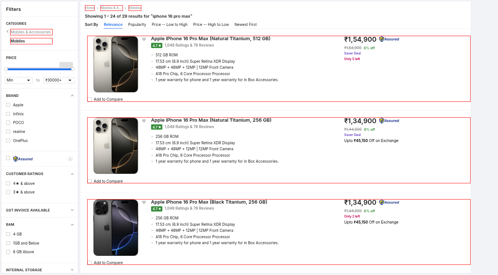
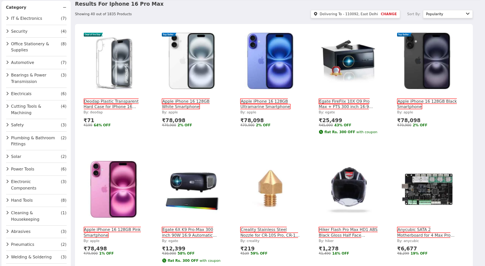

# 🌍 BX Test – Country-based Product Search

**BX Test** is a full-stack web app that lets users select a country and search for products. It uses **OpenAI**, **country-specific proxies**, **Puppeteer** for smart scraping, and **SerpAPI** to discover regional product listings. Redis is used for caching and task coordination between services.

🟢 **Live Demo**: [https://www.temptestdomain.online/](https://www.temptestdomain.online/)

---

## Important Note About AI Detection Features
The screenshots in this README demonstrate AI-powered detection and highlighting of search bars and products (such as JioMart Search Bar Highlight and FlipKart Products Highlight).

Please note: The implementation code for these AI detection features is located in:

- Branch: `uday/discover-search-forms`
- Directory: `./explore` folder

Due to time constraints, this experimental code was not merged into the main branch or integrated into the `./bx-task-be` folder before submission.

## Highlighting of search bar when we find it in page

Below are some example images showing the search bar highlighting feature:

<p align="center">
  
  
</p>

## Highlighting of products that are then sent to AI to judge if they are relevant

<p align="center">
  
  
</p>

---

## How it works

- **Query Handling** - Given a query and country, we use SERP API to search on localized Google (google.it, google.jp, etc.)/Baidu to get the best websites to get listings from
- **Initial Results** - Results from Google/Baidu are the first listings that show up on the results page. 
- **Further Processing** - All domains we get from SERP search and shopping are used to compile a list of domains to be processed.
- **Massively Parallelizable Search** - For each domain, we try to get the search path (ex. /search?q=iphone+16) or the search input and search to get the results. This step can be parallized to a high degree. We use proxy servers and Puppeteer / Headless Chrome for this.
- **Cacheing** - Most of the intermediate steps so far are cached and can be reused in future searches.
- **Results Parsing** - Hueristically parse for results and use OpenAI to judge the results. Only keep the clean and relevant ones.
- **Results** - Each query-country pair's results are saved for future reference
- **Frontend** - FE continously polls the BE for newer results

---

## Future work

- **Better Search** - We try to find the search path and then get the results for search on the website. This is dependant on the host website's making search available to us.
- **Slow right now** - We are --fetching-the-search-path, getting-the-results and parsing-the-results-- for each website. This can be very easily parallized but right now we do it one website at a time.
- **Better Parsing** - LLMs sometimes misjudge the relevance of parsed result to query.
- **Pagination** - Right now we are not using pagination anywhere.

---

## 🚀 Features

- 🌐 **Country Selector** – Select any country to localize your product search. Including China
- 🔍 **Product Search** – Enter a query and get region-specific product listings.
- 🧭 **Per-Country Proxy Support** – Routes scraping via proxies located in the selected country.
- 🤖 **Puppeteer Scraping** – Browser-based scraping simulates real-user interactions.
- 🔗 **SERP API Integration** – Gets region-specific websites before scraping.
- ⚡ **Redis Caching** – Caches results and background tasks to speed up future queries.
- 🧠 **OpenAI Integration** – Enhances scraping and results via AI 

---

## 🧱 Project Structure

- **`bx-test-fe`** – Frontend (React/Next.js) for country selection and product search UI.
- **`bx-test-be`** – Backend (FastAPI) that handles search logic, scraping, and caching.
- **Redis** – Used for caching search results and managing task status.
- **OpenAI** – Used to judge product relevancy and extract search input fields 

---

## 🛠️ Tech Stack

| Layer        | Technology                   |
|--------------|------------------------------|
| Frontend     | React / Next.js / TypeScript |
| Backend      | FastAPI (Python)             |
| Scraping     | Puppeteer (via Pyppeteer)    |
| Caching      | Redis                        |
| Search API   | [SerpAPI](https://serpapi.com) |
| AI API       | [OpenAI](https://openai.com) |
| Proxy Routing| Per-country Proxy Support    |

---

## 📦 Setup Instructions

### 🔧 Prerequisites

- Node.js and npm
- Python 3.9+
- Redis server
- [SERP API key](https://serpapi.com)
- [OpenAI API key](https://platform.openai.com)
- Proxy provider with OxyLabs
- Docker (optional)

---

### 🧠 Backend (`bx-test-be`)

```bash
cd bx-test-be

# Create virtual environment
python -m venv venv
source venv/bin/activate

# Install Python dependencies
pip install -r requirements.txt

# Set environment variables
export OX_USERNAME=your_oxylabs_username
export OX_PASSWORD=your_oxylabs_password
export SERP_API_KEY=your_serp_api_key
export OPENAI_API_KEY=your_openai_api_key

# Run FastAPI backend
uvicorn main:app --reload
